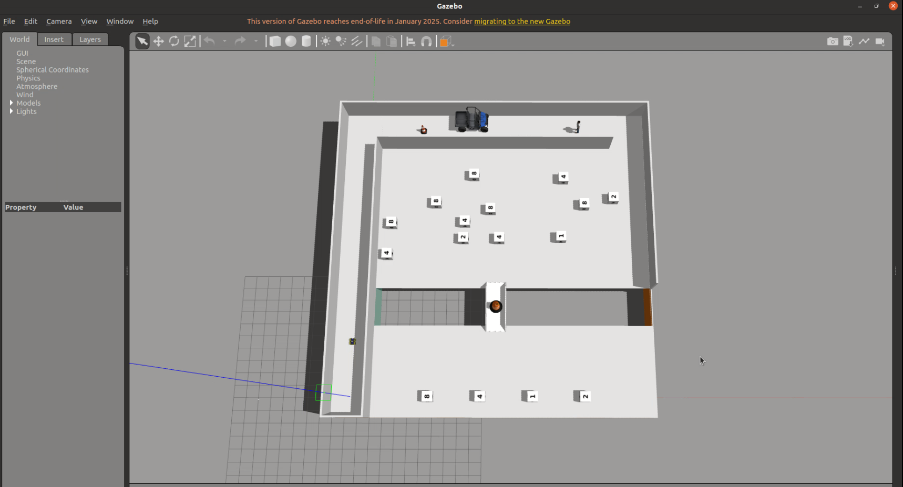
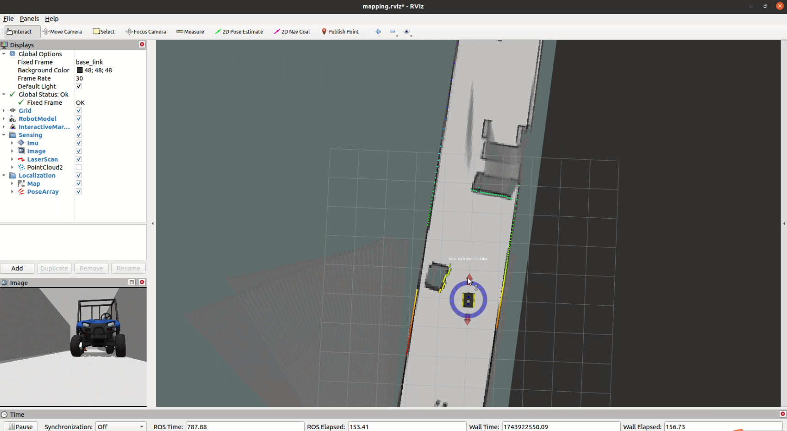
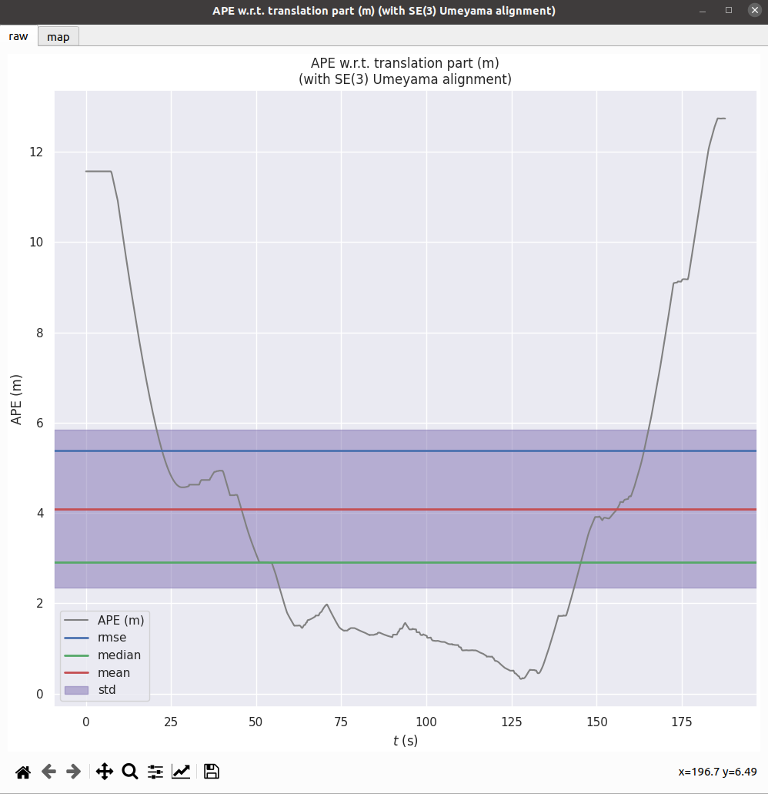
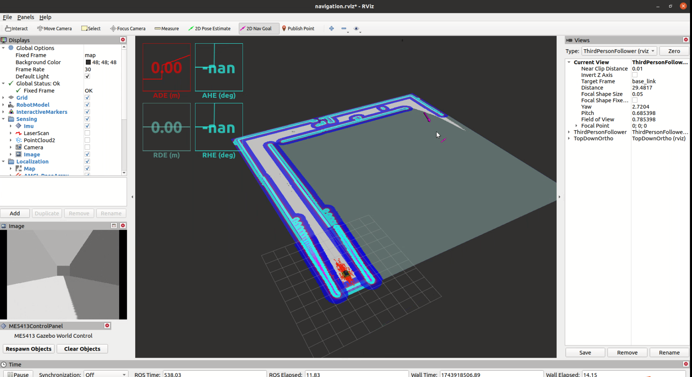
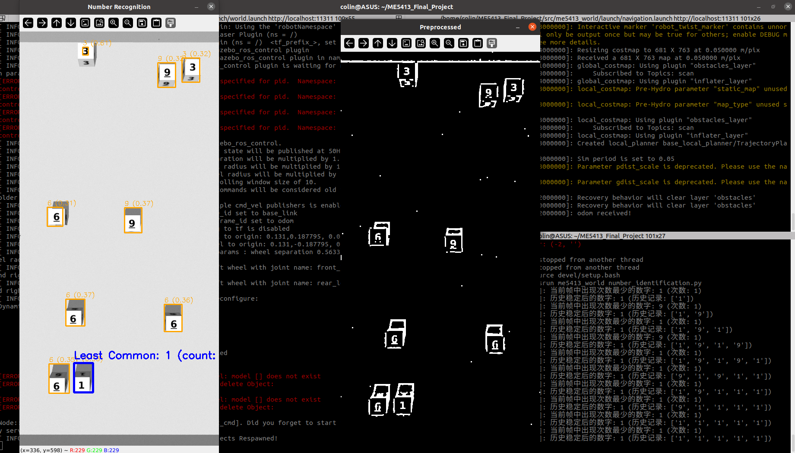
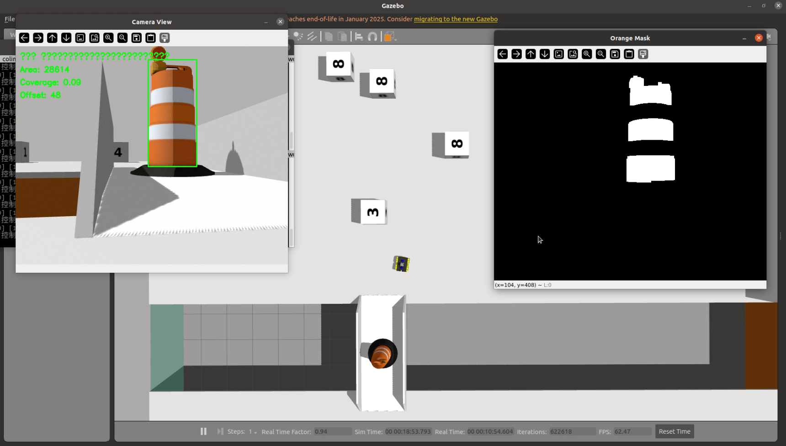
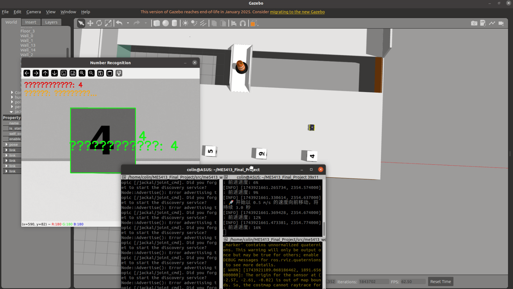

# ME5413_Final_Project Implementation Guide

This is the **NUS ME5413 Autonomous Mobile Robotics Final Project** by Group 11

Please consider referring to original readme of original project provided: [Porject README Link](README_Original.md)

> Authors: [Cheng Yuchao](https://github.com/Einste1n1376), [Hu Jikai](https://github.com/cuteyuki), [Xu Chunnan](https://github.com/MINITACO715), [Zhou Tianli](https://github.com/Zhou-Tianli), [Wang Hexian](https://github.com/WHX258), and [Shen Yilun](https://github.com/syl020119)


## Project Overview

This project is the final implementation for the NUS ME5413 Autonomous Mobile Robots course. It features a complete autonomous navigation and task execution system based on the Jackal robot platform in a Gazebo simulation environment.

## Dependencies

* System Requirements:
  * Ubuntu 20.04 (18.04 not yet tested)
  * ROS Noetic (Melodic not yet tested)
  * C++11 and above
  * CMake: 3.0.2 and above
* This repo depends on the following standard ROS pkgs:
  * `roscpp`
  * `rospy`
  * `rviz`
  * `std_msgs`
  * `nav_msgs`
  * `geometry_msgs`
  * `visualization_msgs`
  * `tf2`
  * `tf2_ros`
  * `tf2_geometry_msgs`
  * `pluginlib`
  * `map_server`
  * `gazebo_ros`
  * `jsk_rviz_plugins`
  * `jackal_gazebo`
  * `jackal_navigation`
  * `velodyne_simulator`
  * `teleop_twist_keyboard`
* And this [gazebo_model](https://github.com/osrf/gazebo_models) repositiory

## Installation

```bash
# Clone the project
cd
git clone https://github.com/Einste1n1376/ME5413_Final_Project.git
cd ME5413_Final_Project

# Install all dependencies
rosdep install --from-paths src --ignore-src -r -y

# Build the project
catkin_make
# Set up environment variables
source devel/setup.bash
```

## Workflow

The project tasks are divided into four main phases:

1. Simulation world loading
2. Mapping
3. Navigation task execution
4. Evaluation and testing

## 1. Simulation World Loading

Load the Gazebo simulation environment with the Jackal robot:

```bash
# Launch the simulation environment with the robot
roslaunch me5413_world world.launch
```

This launch file will:
- Load the project's simulation world
- Spawn the Jackal robot in the world
- Load configuration information for target locations



## 2. Mapping

This project uses Cartographer for SLAM map construction:

```bash
# Start Cartographer for map building
roslaunch me5413_world mapping.launch
```

This launch file will:
- Initialize keyboard teleoperation for robot control
- Load the Cartographer node to process lidar data
- Generate an occupancy grid map
- Launch a configured RViz to visualize the mapping process in real-time



After completing the map construction, save the map:

```bash
# Save the map as my_map
roscd me5413_world/maps/
rosrun map_server map_saver -f my_map map:=/map
```

## 3. Map Evaluation

Use the EVO tool to evaluate SLAM algorithm accuracy:

```bash
# Compare odometry with ground truth
evo_ape bag mapping_data.bag /gazebo/ground_truth/state /odometry/filtered --align --plot
```

This command will:
- Load recorded trajectory data
- Compare ground truth and SLAM-estimated trajectories
- Generate evaluation reports and visualization results



## 4. Navigation Task Execution

```bash
# Load the map and start the AMCL localizer
roslaunch me5413_world navigation.launch
```

This launch file will:
- Load the previously built map
- Start the AMCL localization system
- Launch the MoveBase navigation functionality
- Start a configured RViz interface
- Disable IMU data (to prevent interference)
- Launch the integrated mission controller node



### 4.1 Integrated Mission Controller

The main task workflow is controlled by the `integrated_mission_controller.py` script, which implements the complete task execution logic:

1. **Navigation Phase**: Controls the robot through the first area avoiding obstacles
   - Sets two key navigation points
   - First point helps avoid obstacles in the first area
   - Second point reaches the "river bank" to observe obstacle generation

2. **Number Recognition Phase**: Uses the `number_identification.py` program
   - Recognizes numbers appearing in the scene
   - Counts frequency of each number
   - Determines the least frequent number
   - Publishes this number to the `/recognized_number` topic

3. **Bridge Crossing Phase**: Uses the `auto_detector_controller.py` program
   - Uses vision to recognize orange barrier buckets
   - Determines movement direction and speed
   - Navigates to the obstacle
   - Publishes a message to open the bridge
   - Removes obstacles on the bridge and crosses it

4. **Opposite Bank Tasks**: Uses the `after_bridge_front_recognize.py` program
   - Publishes four new target points to help the robot reach different numbers
   - Recognizes the number at each position
   - Finds the location matching the previously determined "least frequent number"
   - Navigates closer to the target number
   - Terminates all programs after completing the task

## Key Code Modules

### 1. integrated_mission_controller.py

The integrated mission controller is responsible for coordinating and executing the overall task flow:

- Implements multi-stage task management (navigation, number recognition, bridge crossing, opposite bank tasks)
- Manages navigation waypoint publishing and status monitoring
- Launches and monitors the execution of various functional nodes
- Provides task status updates and failure recovery mechanisms

How to run:
```bash
rosrun me5413_world integrated_mission_controller.py
```

### 2. goal_nav_node.py

Navigation point management module, responsible for:

- Publishing navigation waypoints
- Listening to navigation status feedback
- Implementing initial position setup
- Sequential execution of multiple navigation waypoints

How to run:
```bash
rosrun me5413_world goal_nav_node.py
```

### 3. number_identification.py

Number recognition module with functions including:

- Processing camera image data
- Using image processing techniques to recognize numbers
- Counting occurrences of each number
- Determining and publishing the least frequent number

How to run:
```bash
rosrun me5413_world number_identification.py
```

Implementation details:
- Uses OpenCV for image preprocessing (contrast enhancement, noise filtering)
- Applies contour detection to find potential number regions
- Uses Tesseract OCR for number recognition
- Non-maximum suppression algorithm to filter overlapping detection boxes



### 4. auto_detector_controller.py

Orange barrier bucket detection and obstacle avoidance controller:

- Receives front camera image data
- Identifies orange objects in the image (HSV color space filtering)
- Calculates obstacle position, size, and offset information
- Determines robot movement strategy based on obstacle conditions
- Controls the robot to approach targets and sends bridge opening signals

How to run:
```bash
rosrun me5413_world auto_detector_controller.py
```

Control strategy:
- Adjusts steering angle based on obstacle position offset
- Adjusts forward speed based on obstacle size
- Designs special control strategies for the final approach phase
- Implements speed control for bridge crossing mode



### 5. after_bridge_front_recognize.py

Opposite bank number recognition and approach controller:

- Receives front camera image data
- Recognizes numbers in the image
- Compares with the target number
- Controls the robot to approach when a matching number is found

How to run:
```bash
rosrun me5413_world after_bridge_front_recognize.py
```

Implementation details:
- Image preprocessing to enhance number visibility
- Contour detection to find number regions
- Uses history recording mechanism to improve recognition stability
- Executes simplified approach strategy (timed control)



## Running Process Detailed

1. First launch the simulation environment
2. Use Cartographer to build the map
3. Start navigation.launch, which will load:
   - Previously built map
   - AMCL localization system
   - MoveBase navigation system
   - Integrated mission controller

The integrated mission controller will automatically:
- Guide the robot to complete the first phase of obstacle avoidance
- Start number recognition after reaching the river bank
- Begin the bridge crossing task after determining the target number
- Control the bridge crossing process through visual recognition
- Find and approach the target number after reaching the opposite bank

## Parameter Adjustment

Each module can be optimized by adjusting key parameters:

- Navigation parameters: in /ME5413_Final_Project/src/jackal_navigation/params directory
- Visual recognition parameters: HSV thresholds and detection parameters in Python scripts
- Motion control parameters: Speed and timing settings in scripts

## Summary

This project implements a complete autonomous mobile robot system that includes:
- SLAM map construction
- Autonomous navigation
- Visual detection and recognition
- Motion planning and control in complex environments
- Multi-stage task planning and execution

These functionalities together form a Jackal autonomous robot system capable of completing specified tasks in complex environments.

##Acknowledge

This project is finished from **NUS ME5413 Autonomous Mobile Robotics**

Many Thanks to **Professor. Marcelo** and @ NUS Advanced Robotics Centre